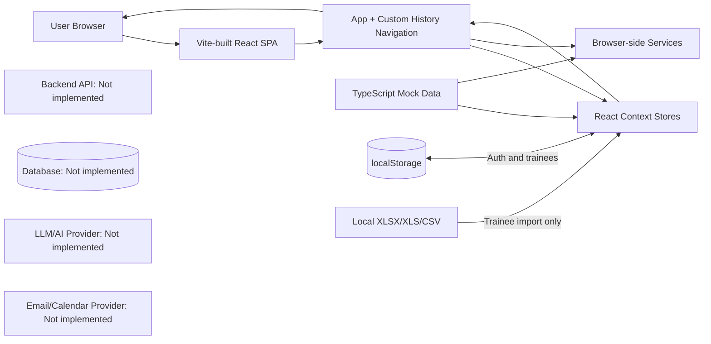
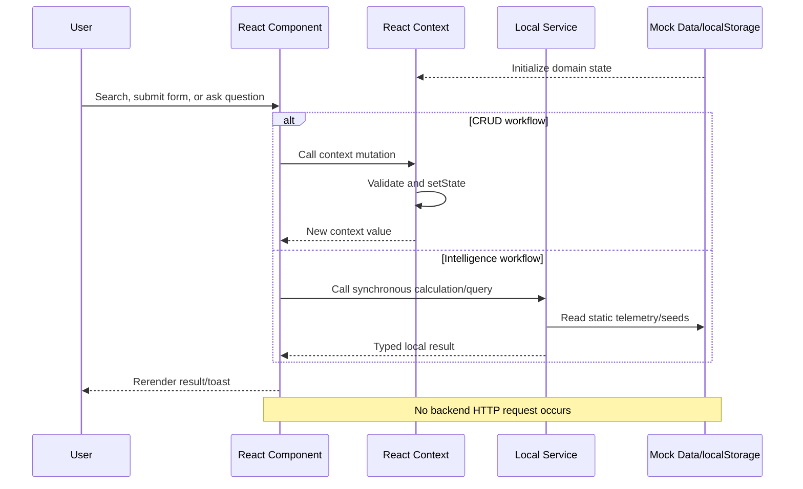

# Systech L&D Intelligence Platform — Complete Technical and Functional Analysis

Audit date: 28 August 2026  
Repository audited: current workspace source, configuration, dependency manifest, contexts, services, components, types, and datasets. Generated `dist/`, dependencies in `node_modules/`, and Git internals are not application source.

## 1. Project overview

### Simple explanation

The project is a browser-based prototype for managing an organization's learning and development program. An L&D administrator can sign in, view a command center, manage bootcamps and trainees, schedule sessions, record attendance and assessment scores, capture trainer feedback, and inspect skill, certification, and performance intelligence.

The application solves the problem of information being scattered across training calendars, spreadsheets, assessments, feedback records, and certification trackers. Its intended outcome is one operational view of trainee progress and readiness.

The current product is a frontend prototype. It does **not** connect to a production backend, database, identity provider, email server, calendar provider, or LLM. Most information is loaded from TypeScript mock arrays. Most changes live only in React memory; trainee changes alone are saved to browser `localStorage`.

### Target users

- L&D administrators: primary implemented persona and the only demo login role.
- Trainers and coordinators: represented in data and workflows, but separate role-specific applications/permissions are not implemented.
- Trainees/employees: represented as managed records; a trainee self-service UI is not currently implemented.

### Main use cases

- Authenticate with demo administrator credentials.
- Monitor learning KPIs and activity.
- Create, update, duplicate, archive, and delete bootcamps; manage modules and rosters.
- Add, edit, transfer, archive, and import trainees.
- Schedule, edit, reschedule, cancel, and complete sessions; record attendance.
- Create assessments, enter scores, complete assessments, and publish results.
- Add/import trainer feedback and generate local rule-based insights.
- Explore skill readiness, project fit, track recommendations, and cohort gaps.
- Explore certification recommendations, tracking, and certified talent.
- Review overall and individual analytics.

### Runtime workflow

1. `index.html` loads the Vite bundle.
2. `src/main.tsx` mounts React inside `ErrorBoundary`.
3. `src/App.tsx` creates the provider hierarchy: authentication → bootcamps → trainees → sessions → assessments → feedback.
4. `AuthContext` reads `ld_platform_authenticated` and `ld_platform_user` from `localStorage`.
5. An unauthenticated user is sent to `/login`; a successful hardcoded demo login sets browser storage and opens `/command-center`.
6. `AppShell` uses `window.history` plus `currentNav` state to select a page. There is no React Router package.
7. Pages read static datasets and React Context state, calculate filters/KPIs in the browser, and render the result.
8. User mutations call context functions, which update React state and display a three-second toast. With the exception of trainees, a reload restores original mock data.

## 2. Complete functionality report

| Feature | Purpose | User action | System processing | Output |
|---|---|---|---|---|
| Demo login | Gate access to the prototype | Enter email/password or demo credentials | `LoginPage.handleSubmit` → `AuthContext.login` → `DemoAuthService.login`; string comparison only | Authenticated shell or validation error |
| Command Center | High-level L&D monitoring | Open dashboard, inspect panels | Components read `src/data/mockData.ts` and local inline arrays | Static KPI, chart, insight, attention, activity, certification panels |
| Bootcamp management | Manage cohorts | Search/filter; create/edit/duplicate/archive/delete | `BootcampManagement` opens modals; `BootcampContext` mutates in-memory arrays/maps | Updated cards/table and toast until reload |
| Cohort details | Inspect one bootcamp | Open cohort; manage roster/modules | `BootcampDetails` combines Bootcamp, Session, and Assessment contexts | Overview, trainees, curriculum, schedule, assessment stats |
| Trainee management | Manage employee learning records | Search/filter; add/edit/transfer/archive/import | `TraineeContext` mutates state and persists `ld_trainees` | Directory, profile data, import summary, toast |
| Trainee profile | Consolidated learner view | Open profile/tabs | Reads trainee plus computed assessment and attendance stats | Overview, journey, progress, attendance, assessments, skills |
| Sessions/calendar | Operate training schedule | Filter, schedule, edit, drag/reschedule, cancel, complete | `SessionContext` checks conflicts and mutates in-memory sessions | Schedule/calendar/module views and status updates |
| Attendance | Record attendance | Mark present/late/absent and save | `recordAttendance` updates attendance map/session and calls `updateTrainee` | Attendance records and recalculated trainee percentage |
| Assessments | Manage evaluations | Create, edit, score, complete, publish, duplicate, archive | `AssessmentContext` mutates assessments/results and can create a session | Assessment views, scores, status/KPIs, trainee status updates |
| Trainer feedback | Capture qualitative performance | Add/import/review/approve/publish/archive | `FeedbackContext` mutates in-memory records; AI analysis uses predefined text | Feedback cards/tables and generated-looking insight text |
| Skill Intelligence | Decision-support launcher | Open six focused functions; ask questions; match projects | `skillIntelligenceService` calculates over its own static telemetry array | Rankings, matrix, fit, track, coverage, Copilot result |
| Certifications | Credential decision support | Filter tabs, query Copilot, inspect recommendations/tracker | `certificationIntelligenceService` derives results from static seeds | Portfolio, recommendations, tracker, certified gallery |
| Analytics | Overall/individual performance | Apply filters, select trainee | `AnalyticsView` calculates directly from `TraineeContext` with `useMemo` | KPIs, charts, tables, performance narrative |
| Spreadsheet template/export | Support trainee import | Download template | SheetJS creates workbook in browser | `Trainee_Import_Template.xlsx` download |
| Trainee spreadsheet import | Bulk-create/update trainees | Select XLSX/XLS/CSV, preview, confirm | `FileReader` + SheetJS parse first worksheet; normalizes and validates rows | Context updates, audit record, success counts |
| Calendar spreadsheet import | Intended bulk session import | Select file and validate | File content is **not parsed**; one hardcoded row is submitted | Simulated success; mock session import |
| Feedback spreadsheet import | Intended bulk feedback import | Select file, validate, run AI, import | File content is **not parsed**; predefined rows and timed progress are used | Simulated imported feedback |
| Email notifications | Intended trainer communication | Schedule/send or approve email preview | Local template generator; `NotificationService` stores record in private array | “Sent” UI status only; no real email |
| Global notifications | Inform user of mutations | Perform context operation | `BootcampContext.showToast` sets message for 3 seconds | In-app toast |

### Actual call pattern

There are no API endpoints. For implemented CRUD, the real call pattern is:

`Button/modal handler → React Context method → setState → dependent components rerender → optional localStorage write/toast`

Example: add trainee:

`AddTraineeModal.handleSubmit` → `useTrainees().addTrainee(data)` → choose bootcamp from `BootcampContext` → construct `Trainee` → `setTrainees` → `useEffect` serializes to `localStorage['ld_trainees']` → directory rerenders.

## 3. Technology stack

| Layer | Technology | Purpose | Where used |
|---|---|---|---|
| UI framework | React 18.2 | Component rendering and stateful UI | All `.tsx` files; mounted in `src/main.tsx` |
| Language | TypeScript 5.3 | Static typing | Components, contexts, services, types, Vite config |
| Build tool | Vite 5 | Development server and production bundling | `vite.config.ts`, package scripts |
| Styling | Global CSS + utility-like class names | Entire design system and page styling | `src/index.css`, very large `src/App.css`, modal CSS |
| Animation | Framer Motion 13 | Page/card/modal animation | Many page components |
| 3D | Three.js 0.162 | Login visual scene | `ThreeVisualizer.tsx`, reached through `LeftVisualPanel.tsx`; current `LoginPage` implements its own visual and does not import `LeftVisualPanel` |
| Icons | Lucide React | Interface icons | Across pages/components |
| Accessible primitives | Radix Dialog/Tooltip plus installed Dropdown/Select/Tabs packages | UI primitives | `ui/Modal.tsx` and `ui/Tooltip.tsx` directly use Radix; many other controls are custom |
| Spreadsheet processing | SheetJS `xlsx` | Trainee workbook generation and parsing | `ImportTraineesModal.tsx` |
| Class composition | `clsx` | Conditional class utility | UI components where imported |
| State management | React Context + local `useState` | Shared domain state and component UI state | `src/context/*`, page components |
| Routing | Custom History API state | Top-level and Skill Intelligence URL navigation | `App.tsx`, `AppShell.tsx`, `SkillIntelligenceView.tsx` |
| HTTP client | None | No network data layer | `fetch`, Axios, GraphQL clients are absent |
| Package manager | npm | Dependency locking/scripts | `package.json`, `package-lock.json` |
| Charts | Custom SVG/CSS/HTML | Graphs and bars | Dashboard and Analytics components; no chart library |

Tailwind CSS is **not currently implemented**. The code uses many Tailwind-looking class strings, but `tailwindcss`, PostCSS configuration, and Tailwind configuration are absent. Their visual effect depends on matching custom/global CSS, where defined.

## 4. Backend technology

**Not currently implemented.**

- Backend language/framework: not currently implemented.
- REST/GraphQL/WebSocket API: not currently implemented.
- Controllers, routes, middleware: not currently implemented.
- Server authentication/authorization: not currently implemented.
- Server validation: not currently implemented.
- Database/service repository layer: not currently implemented.
- Background jobs/queues: not currently implemented.
- External AI/email/calendar integrations: not currently implemented.

Files under `src/services/` are browser-side modules, not backend services:

- `authService.ts`: hardcoded demo credential comparison.
- `skillIntelligenceService.ts`: synchronous calculations over `MASTER_TRAINEES`.
- `certificationIntelligenceService.ts`: synchronous calculations over catalog/recommendation seeds.
- `analyticsService.ts`: static analytics service; currently not consumed by `AnalyticsView`.
- `trainerService.ts`: combines trainer names from calendar/bootcamp datasets.
- `AICommunicationService.ts`: string-template email generator; no model call.
- `NotificationService.ts`: in-memory conflict check and simulated sent records.

## 5. Database and data storage

### Database

SQL database: **Not currently implemented.**  
NoSQL database: **Not currently implemented.**  
Cloud/object/vector storage: **Not currently implemented.**

| Storage/source | Data | Access/update | Persistence |
|---|---|---|---|
| TypeScript arrays | Dashboard metrics/activity | Imported directly from `src/data/mockData.ts` | Bundled static data |
| TypeScript arrays | Bootcamps/modules/users | `bootcampMockData.ts` → `BootcampContext` | Memory; resets on reload |
| TypeScript arrays | Trainees | `traineeMockData.ts` → `TraineeContext` | Seed data; then browser-persistent |
| `localStorage.ld_trainees` | Current trainee array | Read by `loadPersistedTrainees`; written on every trainee change | Persists per browser/origin |
| TypeScript arrays | Sessions/calendar and attendance | `companyCalendarDataset.ts`, `sessionMockData.ts` → `SessionContext` | Memory; resets on reload |
| TypeScript arrays | Assessments/results | `assessmentMockData.ts` → `AssessmentContext` | Memory; resets on reload |
| Context-local array | Feedback records | `INITIAL_MOCK_FEEDBACK` inside `FeedbackContext.tsx` | Memory; resets on reload |
| Service-local arrays | Skill telemetry | `MASTER_TRAINEES` in `skillIntelligenceService.ts` | Static and separate from trainee context |
| Service-local arrays | Certification catalog/recommendations | `certificationIntelligenceService.ts` | Static |
| Service private array | Simulated notifications | `NotificationService.notifications` | Memory; resets on reload |
| `localStorage` auth keys | Auth flag/user/remembered email | `AuthContext`, `authService` | Browser-persistent until logout/clear |
| Context-local audit array | Trainee import audit history | `TraineeContext.auditHistory` | Memory only |
| Uploaded trainee workbook | User-provided spreadsheet | `FileReader` and SheetJS in browser | File not stored; parsed rows may enter `ld_trainees` |

`sessionStorage` is not used.

## 6. How data is fetched

No application data is fetched over a network. There are no `fetch()` calls, Axios calls, GraphQL queries, WebSockets, database queries, or environment-configured base URLs.

| Data required | Source | Frontend file | Request | Backend endpoint/function | Final destination |
|---|---|---|---|---|---|
| Authentication | Hardcoded constants | `authService.ts`, `AuthContext.tsx` | Direct function call | Not implemented | `localStorage`, `AppShell` |
| Dashboard | Static arrays | `CommandCenter/*` | ES module import | Not implemented | KPI/chart/panel UI |
| Bootcamps/modules | Mock arrays + context memory | `BootcampContext.tsx` | Context hook | Not implemented | Bootcamp pages |
| Trainees | `localStorage` or mock seed | `TraineeContext.tsx` | `localStorage.getItem` | Not implemented | Trainee/Analytics pages |
| Sessions | Calendar TypeScript dataset | `SessionContext.tsx` | ES module import | Not implemented | Session/calendar pages |
| Attendance | Mock map + context memory | `SessionContext.tsx` | Context hook | Not implemented | Attendance/profile |
| Assessments/results | Mock arrays/maps | `AssessmentContext.tsx` | Context hook | Not implemented | Assessment/profile/cohort pages |
| Feedback | Context-local mock array | `FeedbackContext.tsx` | Context hook | Not implemented | Feedback page |
| Skill intelligence | Static telemetry service | `SkillIntelligenceView.tsx` | Synchronous service call | Not implemented | Focused intelligence views |
| Certifications | Static service seeds | `CertificationIntelligenceView.tsx` | Synchronous service call | Not implemented | Certification tabs/drawers |
| Analytics | Trainee/bootcamp contexts | `AnalyticsView.tsx` | `useMemo` calculations | Not implemented | Analytics UI |
| Imported trainees | Local spreadsheet | `ImportTraineesModal.tsx` | `FileReader`, SheetJS | Not implemented | `TraineeContext`, `localStorage` |

### Example actual flow: dashboard

`CommandCenterView` renders child components → each component imports an array from `mockData.ts` → JavaScript maps/calculates that array → React renders cards/SVG. No `useEffect` request and no backend are involved.

### Example actual flow: skill Copilot

User selects a question → `handleCopilotQuestion` sets a 500 ms timer → `skillIntelligenceService.askCopilot(question)` performs keyword matching and calculations over `MASTER_TRAINEES` → returns `CopilotQueryResult` → component state updates → response card renders.

## 7. API endpoint report

There are **no backend API endpoints** in this repository.

| Method | Endpoint | Purpose | Body/response | Called from |
|---|---|---|---|---|
| — | Not currently implemented | All domain persistence/integrations | — | — |

Vercel's rewrite `/(.*) → /index.html` and Netlify-style `/* /index.html 200` are SPA hosting rewrites, not APIs.

## 8. Frontend-to-backend connection

**Not currently implemented.**

- Base API URL: not present.
- API environment variable: not present.
- Development/production backend URL: not present.
- Vite proxy: not configured.
- CORS: not configured because there is no server.
- HTTP request/response/error format: not defined.

The current equivalent is an in-process function call:

`UI handler → Context/service JavaScript function → mock/context data → return value or setState → React rerender`

## 9. Application data flow

### Read flow

`Static TypeScript data/localStorage → Provider initialization → useContext/useMemo/service calculation → component props/state → rendered UI`

### Mutation flow

`User action → modal/page handler → context method → validation/conflict calculation → setState → optional cross-context update → toast → rerender`

Cross-context examples:

- Attendance save updates `SessionContext.attendanceMap`, session attendance totals, and `TraineeContext.attendancePercent`.
- Completing an assessment updates assessment aggregates and trainee average score/learning status.
- Creating a scheduled assessment asks `SessionContext.createSession` to create a linked calendar event.
- Creating an assessment calls `NotificationService.sendTrainerNotification`, which only creates an in-memory record.

## 10. Page-wise analysis

### Login

- Purpose: demo administrator access.
- Files: `LoginPage.tsx`, `AuthContext.tsx`, `authService.ts`; `LoginForm.tsx` is a separate similar component and is not used by `App.tsx`.
- Data: hardcoded `DEMO_CREDENTIALS` and mock `AuthUser`.
- API: not implemented.
- Actions: login, remember email, fill demo credentials, forgot-password alert.
- Output: loading/success/error state and redirect to Command Center.

### Command Center

- File: `CommandCenter/CommandCenterView.tsx` and its nine child panels.
- Data: `mockData.ts` plus an inline redesigned AI insight array.
- Actions: largely inspection; header notification/profile controls are UI-level.
- Output: static KPIs, custom learning SVG chart, bootcamp performance, AI insights, attention table, upcoming/recent activity, certification snapshot.
- Live context/API: none.

### Bootcamps

- Files: `BootcampManagement.tsx`, `CreateBootcampModal.tsx`, `TraineeSelectionModal.tsx`, `AddModuleModal.tsx`, `ArchiveConfirmModal.tsx`.
- Data: `BootcampContext`, `bootcampMockData.ts`, central trainer directory.
- Actions: year/type/status/search filters, cards/table modes, create/edit/duplicate/archive/delete, roster and module actions.
- Processing: context state mutations only.
- Output: filtered cohort directory and toasts.

### View Cohort

- File: `BootcampDetails.tsx`.
- Data: Bootcamp, Session, and Assessment contexts.
- Actions: tabs, edit/delete cohort, manage roster, add/edit/delete/reorder modules, record attendance from schedule.
- Navigation: internal `currentNav='bootcamp-details'`; it does not have a dedicated pathname/ID route.
- Persistence/API: not implemented.

### Trainees

- Files: `TraineeManagement.tsx` and four modals.
- Data: `TraineeContext`, `BootcampContext`.
- Actions: search/filters/view modes; add/edit/transfer/archive; import workbook; open profile/progress.
- Processing: trainee context; `ld_trainees` persistence.
- Output: live directory and KPI counts.

### Trainee Profile

- File: `TraineeProfile.tsx`.
- Data: selected trainee, `getTraineeAssessmentStats`, `getTraineeAttendanceStats`, bootcamps; several learning/skills values are hardcoded in JSX.
- Actions: tabs and edit profile.
- Navigation: internal `currentNav='trainee-profile'`; no ID pathname.
- Output: learner summary, journey, progress, attendance, assessments, skills.

### Sessions

- Files: `SessionManagement.tsx`, `CalendarView.tsx`, `ScheduleView.tsx`, `ModuleView.tsx`, scheduling/reschedule/cancel/import/email modals.
- Data: `SessionContext`, company calendar dataset, attendance seed, bootcamps/trainers.
- Actions: filter, switch view, schedule/edit/reschedule/cancel/complete, drag calendar event, import calendar, preview/send email.
- Processing: conflict detection and context mutations.
- Integration caveats: calendar import and emails are simulated; no calendar or SMTP/Graph API.

### Session Details and Attendance

- Files: `SessionDetails.tsx`, `AttendanceManagement.tsx`.
- Data: selected session, enrolled/trainee records, attendance map.
- Actions: inspect session, open attendance, mark statuses/remarks, mark all, clear, save.
- Output: updated in-memory attendance and trainee percentage.

### Assessments

- Files: `AssessmentManagement.tsx`, `CreateAssessmentModal.tsx`, `EnterScoresModal.tsx`, `AssessmentDetailsModal.tsx`, `AssessmentContext.tsx`.
- Data: assessment/result seeds, bootcamps, trainees, sessions.
- Actions: extensive filters, create/edit, enter scores, complete, publish, duplicate, archive, inspect details.
- Output: KPIs, cards/table, results and status updates.
- Caveat: “archive” removes the record from memory; notification/calendar integration is local only.

### Feedback

- Files: `FeedbackManagement.tsx`, `AddTrainerFeedbackModal.tsx`, `ImportTrainerFeedbackModal.tsx`, `FeedbackContext.tsx`.
- Data: context-local initial records, trainees, bootcamps, trainer directory.
- Actions: filter, add, view/edit, approve/publish, regenerate insight, archive, import.
- Output: feedback directory and AI-looking summaries.
- Caveat: AI and workbook import are mocked; feedback is not persistent.

### Skill Intelligence

- Files: `SkillIntelligenceView.tsx`, `skillIntelligenceService.ts`.
- Views: hub plus `copilot`, `skill-matrix`, `project-fit`, `track-allocation`, `cohort-coverage`, `talent-snapshot` query-state views.
- Data: separate static `MASTER_TRAINEES`; bootcamps only populate the matrix filter control.
- Processing: readiness formula, sorting, weighted project matching, track rules, averages, keyword-based Copilot.
- Caveats: no LLM; selected Bootcamp/Track matrix states are displayed but are not applied in `filteredTrainees` (search only).

### Certifications

- Files: `CertificationIntelligenceView.tsx`, `CertificationDetailsModal.tsx`, `certificationIntelligenceService.ts`.
- Data: static certification catalog, recommendation seeds, skill telemetry-derived calculations.
- Actions: tabs/filters, details/readiness drawer, local Copilot, tracker status modal.
- Output: portfolio, recommendations, tracker, certified gallery.
- Caveat: “Save Certification Status” only closes the modal; no record is updated or persisted.

### Analytics

- File: `AnalyticsView.tsx`.
- Data: live `TraineeContext` and `BootcampContext`; calculations in `useMemo`; portions of detail content use constants/fallbacks.
- Actions: overall/individual tabs, filters, reset, trainee selection.
- Output: KPIs, custom charts, selected/attention/top lists, employee detail.
- `analyticsService.ts` exists but is not imported by this view, making it currently unused/dead service code.

## 11. Important folder structure

```text
L&D_APP/
├── index.html                    # Vite HTML entry
├── package.json                  # scripts and dependencies
├── vite.config.ts                # port 3000, relative base, dist build
├── tsconfig.json                 # strict browser TypeScript config
├── vercel.json                   # SPA fallback rewrite
├── public/                       # public images and Netlify-style redirect
├── src/
│   ├── main.tsx                  # React root + ErrorBoundary
│   ├── App.tsx                   # provider composition and auth gate
│   ├── index.css                 # tokens/reset/global base
│   ├── App.css                   # main monolithic application styling
│   ├── assets/                   # bundled images
│   ├── components/
│   │   ├── CommandCenter/        # shell/sidebar/dashboard
│   │   ├── Bootcamps/            # cohort management/details/modals
│   │   ├── Trainees/             # directory/profile/import/modals
│   │   ├── Sessions/             # calendar/schedule/attendance/email
│   │   ├── Assessments/          # assessment CRUD/scoring/details
│   │   ├── Feedback/             # feedback CRUD/import
│   │   ├── SkillIntelligence/    # feature hub and focused views
│   │   ├── Certifications/       # certification intelligence
│   │   ├── Analytics/            # overall/individual analytics
│   │   ├── Common/               # animation/visual helpers
│   │   └── ui/                   # reusable UI primitives
│   ├── context/                  # in-browser domain stores/business mutations
│   ├── data/                     # TypeScript mock/seed datasets
│   ├── services/                 # browser-side calculations/templates
│   └── types/                    # domain interfaces/unions
└── dist/                         # generated production assets
```

There is no backend directory, migration folder, database model folder, API route folder, or test directory.

## 12. Important files

| File | Purpose | Importance |
|---|---|---|
| `src/main.tsx` | React mount and global error boundary | Runtime entry |
| `src/App.tsx` | Provider ordering, auth gate, initial path handling | Root architecture |
| `src/components/CommandCenter/AppShell.tsx` | Custom routing, sidebar, page selection, scroll reset | Navigation composition |
| `src/context/AuthContext.tsx` | Browser auth state | Access gate |
| `src/context/BootcampContext.tsx` | Cohort/module/roster state and operations | Domain store |
| `src/context/TraineeContext.tsx` | Trainee CRUD/import and only domain persistence | Domain store |
| `src/context/SessionContext.tsx` | Schedule/conflicts/attendance/import | Domain store |
| `src/context/AssessmentContext.tsx` | Assessment/results/cross-domain updates | Domain store |
| `src/context/FeedbackContext.tsx` | Feedback records and mock AI mutations | Domain store |
| `src/services/skillIntelligenceService.ts` | Readiness/project/track/cohort/Copilot logic | Intelligence logic |
| `src/services/certificationIntelligenceService.ts` | Certification calculations/Copilot | Intelligence logic |
| `src/data/*.ts` | Nearly all initial displayed data | Current data layer |
| `src/components/Trainees/ImportTraineesModal.tsx` | Only real file parsing flow | File integration |
| `src/App.css`, `src/index.css` | Application design system/layout | Visual implementation |
| `vite.config.ts` | Development/build behavior | Build configuration |
| `vercel.json`, `public/_redirects` | SPA deep-link hosting fallbacks | Deployment configuration |

## 13. Dependencies

| Dependency | Used for | Project usage |
|---|---|---|
| `react`, `react-dom` | SPA UI | Core runtime |
| `typescript` | Type checking | All source domains/components |
| `vite`, `@vitejs/plugin-react` | Dev/build | Port 3000 and `dist/` output |
| `framer-motion` | Animations | Pages, cards, modals |
| `lucide-react` | Icons | Widespread |
| `three` | WebGL visualization | `ThreeVisualizer` path, likely currently unused by active login |
| `xlsx` | Spreadsheet parse/write | Real trainee import/template only |
| `clsx` | CSS class composition | Reusable UI components |
| Radix packages | Accessible UI primitives | Dialog and Tooltip are used directly; installed Dropdown/Select/Tabs packages are not directly imported in the inspected source |

There are no Axios, React Router, Redux/Zustand, Tailwind, charting, backend SDK, database client, OpenAI, Azure Identity, Microsoft Graph, or testing dependencies.

## 14. Environment variables

No `.env` files or `import.meta.env`/`process.env` references exist.

| Variable | Purpose | Used by |
|---|---|---|
| — | Not currently implemented | — |

No secrets were found in environment configuration. However, demo credentials and a fake token are hardcoded in source; see security findings.

## 15. Authentication and security

### Current auth flow

`Login form → DemoAuthService.login → compare two hardcoded strings → return mock user/fake token → AuthContext stores boolean/user in localStorage → App renders AppShell`

- JWT validation: not implemented. A JWT-looking string is returned but not stored or verified.
- Cookies/server sessions: not implemented.
- OAuth/Azure AD/SSO: not implemented.
- Authorization/role checks: not implemented.
- Protected APIs: not implemented.
- Password reset: not implemented.

Security concerns:

1. Anyone can set `ld_platform_authenticated=true` in DevTools and bypass login.
2. Credentials and fake token are readable in the client bundle.
3. No server-side identity or authorization boundary exists.
4. Employee/training data is stored in readable browser storage.
5. `ErrorBoundary` offers a “clear local data” recovery action, which clears all origin localStorage.
6. Spreadsheet imports have client validation but no malware scanning, server validation, tenant checks, or audit persistence.

## 16. AI/LLM functionality

The UI contains AI-branded features, but a real AI provider/model is **not currently implemented**.

| AI-labelled capability | Actual implementation |
|---|---|
| Skill Copilot | Keyword/intent matching and deterministic data calculations in `askCopilot` |
| Certification Copilot | Keyword-based deterministic results in `askCertificationCopilot` |
| Analytics “AI summary” | UI/computed/static narrative; `analyticsService` is unused |
| Trainer feedback AI | Predefined summaries/strengths/gaps and timed loading |
| AI email | Template interpolation in `AICommunicationService` |
| Dashboard AI insights | Hardcoded array |

Actual flow:

`User input → component timer → local service function → static context/seed data → conditional/string template logic → component state → UI`

LLM provider/model, prompts, RAG, embeddings, vector database, retrieval, and backend AI endpoint: **Not currently implemented.**

## 17. Error handling

Implemented:

- Root `ErrorBoundary` catches uncaught React render/lifecycle errors and logs details.
- Forms use required-field checks and display local messages.
- Session creation/update rejects trainer overlaps.
- Trainee XLSX parsing catches malformed/empty files and shows an error.
- Context hooks throw when used outside providers.
- Toasts communicate many successful or rejected mutations.
- Many pages include empty-filter states and simulated loading states.

Missing/weak:

- No network/API error handling because no network layer exists.
- No centralized form schema validation.
- No persistent structured error logging/monitoring.
- Several timers are presentation-only and can suggest work that did not occur.
- Some success UI claims external actions (“email sent”) without an external result.
- Calendar/feedback imports do not parse content, so validation feedback is not trustworthy.
- Many destructive operations lack production-grade dependency/cascade validation.

## 18. Deployment architecture

Current build:

`npm run build → tsc → vite build → static files in dist/`

Configured hosting:

- `vercel.json`: all paths rewrite to `index.html`, supporting SPA deep links on Vercel.
- `public/_redirects`: equivalent Netlify SPA fallback.
- `.github/workflows/deploy.yml`: GitHub Pages CI/CD on pushes to `main` or manual dispatch; it uses Node 20, runs `npm ci` and `npm run build`, uploads `dist`, and deploys with the official Pages action.
- Vite uses relative `base: './'`, port 3000 in development, no source maps, and a 1500 KB chunk warning limit.

Backend/database deployment: not currently implemented.  
Docker: not currently implemented.  
Azure/AWS/Firebase/Render configuration: not currently implemented.  
CI/CD: GitHub Pages deployment is implemented in `.github/workflows/deploy.yml`.  
Production monitoring: not currently implemented.

## 19. Current architecture diagram



## 20. Data flow diagram



## 21. Functionality status

| Feature | Status | Frontend | Backend | Data source | Notes |
|---|---|---|---|---|---|
| Login gate | Mock Data | Complete demo UI | Not implemented | Hardcoded credentials/localStorage | Insecure client-only gate |
| Command Center | UI Only | Implemented | Not implemented | Static arrays | Does not reflect context changes |
| Bootcamp CRUD | Partially Implemented | Working in session | Not implemented | Mock + memory | Reload resets changes |
| Trainee CRUD | Fully Implemented (browser prototype) | Working | Not implemented | Mock + localStorage | Only durable domain |
| Trainee XLSX import | Fully Implemented (browser prototype) | Real parse/preview/import | Not implemented | Local file | No server validation |
| Cohort details/modules/roster | Partially Implemented | Working in memory | Not implemented | Context | Some domain consistency gaps |
| Sessions/calendar | Partially Implemented | Working in memory | Not implemented | Static calendar/context | No real calendar integration |
| Calendar file import | UI Only | Wizard works | Not implemented | Hardcoded row | Uploaded file not parsed |
| Attendance | Partially Implemented | Working/cross-updates trainee | Not implemented | Memory + trainee localStorage | Attendance map resets |
| Assessments/scoring | Partially Implemented | Working in memory | Not implemented | Static/context | No durable results |
| Feedback CRUD | Partially Implemented | Working in memory | Not implemented | Context mock | Reload resets |
| Feedback file import | UI Only | Simulated | Not implemented | Predefined rows | File content ignored |
| Skill Intelligence | Mock Data | Functional local rules | Not implemented | Separate static telemetry | Not synchronized to trainee context |
| Certification Intelligence | Mock Data | Functional local display | Not implemented | Static seeds | Status save is nonfunctional |
| Analytics | Partially Implemented | Context calculations | Not implemented | Trainee/bootcamp context | Mixed real context and constants |
| AI/LLM | Not Implemented | AI-branded local simulations | Not implemented | Rules/templates/static | No provider/model/RAG |
| Email sending | UI Only | Preview/status UI | Not implemented | Template/in-memory record | No message leaves browser |
| Notifications/toasts | Fully Implemented (browser UI) | Local toasts | Not implemented | Context memory | No external/persistent alerts |
| Role-based access | Not Implemented | One admin persona | Not implemented | — | Roles are types only |
| Reports/export | Partially Implemented | Trainee template download | Not implemented | SheetJS | No reporting export suite |

## 22. Mock and hardcoded data

| File | Mock/hardcoded content | Used for | Replace with |
|---|---|---|---|
| `data/mockData.ts` | Dashboard KPIs, trends, performance, activities | Command Center | Aggregated backend reporting endpoints |
| `data/bootcampMockData.ts` | Users, bootcamps, modules | Bootcamp context | Bootcamp/user database APIs |
| `data/traineeMockData.ts` | Employee records, scores/status | Trainees/profile/analytics | Employee/LMS source via backend |
| `data/companyCalendarDataset.ts` | 2026 training calendar | Sessions | Calendar/session database integration |
| `data/sessionMockData.ts` | Sessions/attendance | Attendance seed | Session/attendance persistence |
| `data/assessmentMockData.ts` | Assessments/results | Assessment context | Assessment APIs/database |
| `FeedbackContext.tsx` | Initial feedback records | Feedback page | Feedback repository/API |
| `skillIntelligenceService.ts` | Independent telemetry and thresholds | Skill views/Copilot | Unified analytics store + AI service |
| `certificationIntelligenceService.ts` | Catalog/recommendation/certified seeds | Certification views | Credential provider/internal DB APIs |
| `CommandCenter/AiIntelligencePanel.tsx` | Inline “AI” insights | Dashboard | Server-generated reviewed insights |
| `TraineeProfile.tsx` | Multiple fixed journey/skill percentages | Profile tabs | Derived learning/skill records |
| `ImportCalendarModal.tsx` | One fixed imported row | Calendar import demo | Real SheetJS/parser + backend transaction |
| `ImportTrainerFeedbackModal.tsx` | Fixed validation rows | Feedback import demo | Real parser/schema validation |
| `authService.ts` | Credentials/user/token | Demo authentication | Enterprise IdP/OIDC backend session |
| `CertificationIntelligenceView.tsx` | Default dates/score/credential ID; no save | Status modal | Tracker mutation API |
| `NotificationService.ts` | Simulated “Sent” emails | Session/assessment notices | Queued email/calendar provider |

IDs and timestamps are frequently generated with `Date.now()` and some defaults use `Math.random()`. These are suitable for a demo, not authoritative identifiers.

## 23. Technical issues and gaps

| Severity | Issue | Evidence/impact |
|---|---|---|
| Critical | No backend/database | Nearly all business records are lost on reload and cannot be shared/audited |
| Critical | Client-only authentication bypass | LocalStorage boolean and hardcoded credentials provide no security |
| High | AI/email/calendar claims exceed implementation | Deterministic templates/timers can be mistaken for real external actions |
| High | Fragmented sources of truth | Dashboard, trainee context, skill telemetry, certification seeds can disagree |
| High | Sensitive employee data in client bundle/localStorage | No access control, encryption boundary, retention, or tenant isolation |
| High | Calendar/feedback imports ignore uploaded content | Misleading success and data-integrity risk |
| High | Most CRUD is not persistent | Bootcamps, sessions, assessments, feedback, attendance, certification changes reset |
| Medium | Custom routing is incomplete | Detail/profile state has no durable URL/ID; refresh/deep link cannot restore selection |
| Medium | Certification status save does nothing | Button closes modal without mutation |
| Medium | Skill matrix Bootcamp/Track filters are not applied | UI controls do not affect `filteredTrainees` |
| Medium | Assessment-session linking uses stale state | Immediately reading `sessions[0]` after `createSession(setState)` may link the previous session |
| Medium | Domain consistency/cascades | Deleting/archive actions do not comprehensively reconcile related enrollments/sessions/results |
| Medium | Monolithic duplicated CSS | `App.css` is very large and contains repeated Skill Intelligence rules, increasing override risk |
| Medium | No automated tests/lint script | Regressions depend on manual verification and build only |
| Medium | Accessibility uneven | Custom modals/menus may lack focus trapping, keyboard semantics, and announcements |
| Low | Unused/dead code/dependencies | `analyticsService`, `LoginForm`, `LeftVisualPanel`/Three path, `AI_INSIGHTS`, `INITIAL_SESSIONS`, and Radix packages appear unused or partially unused |
| Low | Encoding artifacts | Some source-rendered strings display mojibake sequences such as `•`/`→` |
| Low | README describes aspirations | It mixes roadmap/recommended architecture with current implementation and can overstate capability |

## 24. Recommended architecture

### Current architecture

Static React SPA → Context stores → mock TypeScript arrays/browser services → localStorage for auth/trainees only.

### Recommended architecture

1. Keep React/TypeScript but adopt React Router with stable routes such as `/trainees/:id` and `/bootcamps/:id`.
2. Add a typed backend (for example ASP.NET Core, Node/NestJS, or FastAPI—choose based on organizational standards) with domain controllers/services/repositories.
3. Store bootcamps, enrollments, modules, sessions, attendance, assessments/results, feedback, skills, certifications, notifications, and audit events in a relational database.
4. Use Azure AD/Entra ID OIDC for SSO and server-enforced RBAC (`LD_ADMIN`, trainer, coordinator, trainee).
5. Introduce a generated typed API client and a server-state library such as TanStack Query for caching/loading/error states.
6. Replace duplicated mock datasets with one canonical domain model and backend aggregates.
7. Upload spreadsheets to a validated server endpoint; parse in an isolated worker, return row errors, and commit transactionally.
8. Integrate Microsoft Graph or approved providers for calendar/email. Queue outbound messages and track provider delivery IDs/status.
9. Put AI behind a backend orchestration service with prompt/version logging, redaction, role authorization, structured outputs, citations/evidence, and human approval.
10. Add background jobs for reminders, certification expiry, attendance alerts, and imports.
11. Add schema validation, centralized error contracts, structured logs, telemetry, audit trails, and secrets in managed configuration.
12. Add unit tests for scoring/conflicts/import rules, component tests for workflows, and end-to-end tests for navigation and CRUD.
13. Split `App.css` into tokens, shared components, and feature-scoped styles; remove dead code/dependencies.

Recommended production flow:

`React UI → authenticated HTTPS API → controller → domain service → repository/database and approved external services → validated DTO response → query cache/context → UI`

## 25. Executive summary

### What this project does

It is a polished L&D operations and intelligence prototype covering cohorts, trainees, schedules, attendance, assessments, feedback, skill readiness, certifications, and analytics.

### Frontend technology

React 18, TypeScript, Vite, global/custom CSS, Framer Motion, Lucide, custom SVG charts, Three.js assets, and SheetJS.

### Backend technology

Not currently implemented.

### Database/storage

No database. Static TypeScript datasets and React memory drive nearly everything. Auth and trainees use browser localStorage.

### APIs and data fetching

No API endpoints and no HTTP data fetching. Components import data, read contexts, or call synchronous local services.

### Frontend/backend communication

Not currently implemented.

### External services

Not currently implemented. Email, calendar, identity, and credential-provider behavior is simulated.

### AI integration

No LLM/provider. Current AI-branded experiences are deterministic rules, templates, hardcoded results, and loading timers.

### Authentication

Hardcoded demo credentials and a localStorage flag. No production security or authorization.

### Deployment

Static Vite build with an implemented GitHub Pages workflow plus Vercel and Netlify-style SPA rewrites. No server/database deployment.

### Major working features

Rich frontend navigation and layouts; in-browser bootcamp/trainee/session/attendance/assessment/feedback workflows; real trainee spreadsheet parsing; local skill/certification calculations; trainee persistence; filters, visualizations, toasts, and modals.

### Incomplete features

All production persistence, real authentication/RBAC, backend APIs, real AI, email/calendar delivery, reliable calendar/feedback import, certification status updates, robust routing, reporting exports, and automated testing.

### Main technical risks

Misrepresenting simulated integrations as real, inconsistent duplicated data, loss of in-memory changes, insecure client authentication, employee data exposure, and lack of test/audit infrastructure.

### Recommended next steps

1. Define canonical domain/schema and backend API contracts.
2. Implement enterprise identity and server authorization.
3. Persist core domains in a database and replace context mutations with API calls.
4. Correct misleading simulated imports/notifications and add provider integrations.
5. Unify intelligence inputs, then add governed backend AI if required.
6. Add stable routes, automated tests, observability, audit trails, and CI/CD.
